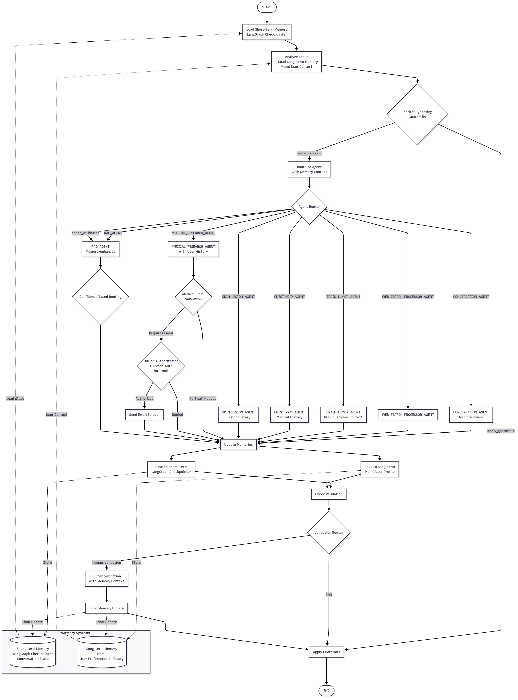

<h1 align="center"><strong>⚕️ Multi-Agent-Medical-Assistant :<h6 align="center">AI-powered multi-agentic system for medical diagnosis and assistance with advanced memory management</h6></strong></h1>

<!--  -->


[](https://github.com/tejpal123456789/virtual-Medical-Lab-AI-Agent/blob/main/LICENSE) 
[](https://github.com/tejpal123456789/virtual-Medical-Lab-AI-Agent/issues)


</div>

----

> [!IMPORTANT]  
> 📋 Version Updates from v2.0 to v2.1 and further:
> 1. **Document Processing Upgrade**: Unstructured.io has been replaced with Docling for document parsing and extraction of text, tables, and images to be embedded.
> 2. **Enhanced RAG References**: Links to source documents and reference images present in reranked retrieved chunks stored in local storage are added to the bottom of the RAG responses.
> 3. **Advanced Memory Management**: Integration of LangGraph Checkpointer for short-term memory and Mem0 for long-term user context management.
> 4. **Enhanced Web Search**: Bright Data integration for comprehensive web research capabilities.
> 5. **Tool Authentication**: Arcade integration for secure tool authorization and human-in-the-loop validation.
>
> To use Unstructured.io based solution, refer release - [v2.0](https://github.com/souvikmajumder26/Multi-Agent-Medical-Assistant/tree/v2.0).
 
## 📚 Table of Contents
- [Overview](#overview)
- [Demo](#demo)
- [Technical Flow Chart](#technical-flowchart)
- [Key Features](#key-features)
- [Tech Stack](#technology-stack)
- [Installation and Setup](#installation-setup)
  - [Using Docker](#docker-setup)
  - [Manual Installation](#manual-setup)
- [Usage](#usage)
- [Contributions](#contributions)
- [License](#license)
- [Citing](#citing)
- [Contact](#contact)

----

## 📌 Overview <a name="overview"></a>

The **Multi-Agent Medical Assistant** is an **AI-powered chatbot** designed to assist with **medical diagnosis, research, and patient interactions**.  

🚀 **Powered by Multi-Agent Intelligence**, this system integrates:  
- **🤖 Large Language Models (LLMs)**  
- **🖼️ Computer Vision Models** for medical imaging analysis  
- **📚 Retrieval-Augmented Generation (RAG)** leveraging vector databases  
- **🌐 Real-time Web Search** for up-to-date medical insights  
- **👨‍⚕️ Human-in-the-Loop Validation** to verify AI-based medical image diagnoses  
- **🧠 Advanced Memory Management** with short-term and long-term memory systems
- **🔒 Secure Tool Authentication** with Arcade for human authorization

### **What You'll Learn from This Project** 📖  
🔹 **👨‍💻 Multi-Agent Orchestration** with structured graph workflows  
🔹 **🔍 Advanced RAG Techniques** – hybrid retrieval, semantic chunking, and vector search  
🔹 **⚡ Confidence-Based Routing** & **Agent-to-Agent Handoff**  
🔹 **🧠 Memory Management** – Short-term conversation state and long-term user context  
🔹 **🔒 Production-Ready AI** with Modularized Code & Robust Exception Handling  
🔹 **🛡️ Security & Authorization** – Tool authentication and human validation workflows  

📂 **For learners**: Check out [`agents/README.md`](agents/README.md) for a **detailed breakdown** of the agentic workflow! 🎯  

## 🛡️ Technical Flow Chart  <a name="technical-flowchart"></a>



The system follows a sophisticated workflow:

1. **🔄 Memory Loading**: Short-term memory (LangGraph Checkpointer) and long-term memory (Mem0) are loaded with conversation state and user context
2. **🛡️ Guardrail Check**: Input validation to determine if bypassing main agent routing is needed
3. **🤖 Agent Routing**: Intelligent routing to specialized agents based on input analysis
4. **🔍 Specialized Processing**: Each agent processes with memory-enhanced context
5. **✅ Validation & Authorization**: Confidence-based routing and human validation when needed
6. **💾 Memory Updates**: Continuous updates to both short-term and long-term memory systems
7. **🛡️ Final Guardrails**: Output validation and safety checks before response delivery

---

## ✨ Key Features  <a name="key-features"></a>

- 🤖 **Multi-Agent Architecture** : Specialized agents working in harmony to handle diagnosis, information retrieval, reasoning, and more

- 🧠 **Advanced Memory Management System** :
  - **Short-term Memory (LangGraph Checkpointer)**: Maintains conversation state and immediate context
  - **Long-term Memory (Mem0)**: Stores user preferences, medical history, and persistent context
  - **Memory-enhanced Processing**: All agents operate with full context awareness
  - **Continuous Memory Updates**: Real-time synchronization between memory systems

- 🔍 **Advanced Agentic RAG Retrieval System** :
  - Docling based parsing to extract text, tables, and images from PDFs
  - Embedding markdown formatted text, tables and LLM based image summaries
  - LLM based semantic chunking with structural boundary awareness
  - LLM based query expansion with related medical domain terms
  - Qdrant hybrid search combining BM25 sparse keyword search along with dense embedding vector search
  - HuggingFace Cross-Encoder based reranking of retrieved document chunks for accurate LLM responses
  - Input-output guardrails to ensure safe and relevant responses
  - Links to source documents and images present in reference document chunks provided with response
  - Confidence-based agent-to-agent handoff between RAG and Web Search to prevent hallucinations

- 🌐 **Enhanced Web Research with Bright Data** :
  - **Comprehensive Web Search**: Bright Data integration for extensive research capabilities
  - **Real-time Medical Updates**: Latest research papers, clinical trials, and medical guidelines
  - **Multi-source Validation**: Cross-referencing information from multiple authoritative sources
  - **Structured Research Output**: Organized and validated research findings

- 🏥 **Medical Imaging Analysis**  
  - Brain Tumor Detection (TBD)
  - Chest X-ray Disease Classification
  - Skin Lesion Segmentation

- 🔒 **Secure Tool Authentication with Arcade** :
  - **Human Authorization Workflow**: Secure approval process for sensitive operations
  - **Email Authorization**: Protected email sending with human validation
  - **Tool Access Control**: Granular permissions for different system capabilities
  - **Audit Trail**: Complete logging of authorization decisions and actions

- 📊 **Confidence-Based Verification** : Log probability analysis ensures high accuracy in medical recommendations

- 🎙️ **Voice Interaction Capabilities** : Seamless speech-to-text and text-to-speech powered by Eleven Labs API

- 👩‍⚕️ **Expert Oversight System** : Human-in-the-loop verification by medical professionals before finalizing outputs

- ⚔️ **Input & Output Guardrails** : Ensures safe, unbiased, and reliable medical responses while filtering out harmful or misleading content

- 💻 **Intuitive User Interface** : Designed for healthcare professionals with minimal technical expertise

> [!NOTE]  
> Upcoming features:
> 1. Brain Tumor Medical Computer Vision model integration.
> 2. Enhanced memory analytics and insights.
> 3. Advanced security features with Arcade.
> 4. Open to suggestions and contributions.

---

## 🛠️ Technology Stack  <a name="technology-stack"></a>

| Component | Technologies |
|-----------|-------------|
| 🔹 **Backend Framework** | FastAPI |
| 🔹 **Agent Orchestration** | LangGraph |
| 🔹 **Document Parsing** | Docling |
| 🔹 **Knowledge Storage** | Qdrant Vector Database |
| 🔹 **Memory Management** | LangGraph Checkpointer (Short-term), Mem0 (Long-term) |
| 🔹 **Web Research** | Bright Data |
| 🔹 **Tool Authentication** | Arcade |
| 🔹 **Medical Imaging** | Computer Vision Models |
| | • Brain Tumor: Object Detection (PyTorch) |
| | • Chest X-ray: Image Classification (PyTorch) |
| | • Skin Lesion: Semantic Segmentation (PyTorch) |
| 🔹 **Guardrails** | LangChain |
| 🔹 **Speech Processing** | Eleven Labs API |
| 🔹 **Frontend** | HTML, CSS, JavaScript |
| 🔹 **Deployment** | Docker, GitHub Actions CI/CD |

## 🚀 Installation and Setup  <a name="installation-setup"></a>

## 📌 Option 1: Using Docker  <a name="docker-setup"></a>

### 1️⃣ Clone the Repository  
```bash  
git clone https://github.com/tejpal123456789/virtual-Medical-Lab-AI-Agent.git  
cd virtual-Medical-Lab-AI-Agent  
```

### 2️⃣ Set Up Environment Variables  
Create a `.env` file in the root directory with the following variables:

```bash
# LLM Configuration (Azure Open AI - gpt-4o used in development)
# If using any other LLM API key or local LLM, appropriate code modification is required
deployment_name= 
model_name=gpt-4o
azure_endpoint=
openai_api_key=
openai_api_version=

# Embedding Model Configuration (Azure Open AI - text-embedding-ada-002 used in development)
# If using any other embedding model, appropriate code modification is required
embedding_deployment_name=
embedding_model_name=text-embedding-ada-002
embedding_azure_endpoint=
embedding_openai_api_key=
embedding_openai_api_version=

# Speech API Key (Free credits available with new Eleven Labs Account)
ELEVEN_LABS_API_KEY=

# Web Search API Key (Free credits available with new Tavily Account)
TAVILY_API_KEY=

# Bright Data Configuration
BRIGHT_DATA_USERNAME=
BRIGHT_DATA_PASSWORD=
BRIGHT_DATA_HOST=
BRIGHT_DATA_PORT=

# Arcade Configuration for Tool Authentication
ARCADEA_API_KEY=
ARCADEA_WORKSPACE_ID=

# Hugging Face Token - using reranker model "ms-marco-TinyBERT-L-6"
HUGGINGFACE_TOKEN=

# (OPTIONAL) If using Qdrant server version, local does not require API key
QDRANT_URL=
QDRANT_API_KEY=

# Memory Management Configuration
MEM0_API_KEY=
LANGGRAPH_CHECKPOINTER_PATH=./checkpoints
```

### 3️⃣ Build the Docker Image
```bash
docker build -t medical-assistant .
```

### 4️⃣ Run the Docker Container
```bash
docker run -d --name medical-assistant-app -p 8000:8000 --env-file .env medical-assistant
```
The application will be available at: [http://localhost:8000](http://localhost:8000)

### 5️⃣ Ingest Data into Vector DB from Docker Container

- To ingest a single document:
```bash
docker exec medical-assistant-app python ingest_rag_data.py --file ./data/raw/brain_tumors_ucni.pdf
```

- To ingest multiple documents from a directory:
```bash
docker exec medical-assistant-app python ingest_rag_data.py --dir ./data/raw
```

### Managing the Container:

#### Stop the Container
```bash
docker stop medical-assistant-app
```

#### Start the Container
```bash
docker start medical-assistant-app
```

#### View Logs
```bash
docker logs medical-assistant-app
```

#### Remove the Container
```bash
docker rm medical-assistant-app
```

### Troubleshooting:

#### Container Health Check
The container includes a health check that monitors the application status. You can check the health status with:
```bash
docker inspect --format='{{.State.Health.Status}}' medical-assistant-app
```

#### Container Not Starting
If the container fails to start, check the logs for errors:
```bash
docker logs medical-assistant-app
```


## 📌 Option 2: Without Using Docker  <a name="manual-setup"></a>

### 1️⃣ Clone the Repository  
```bash  
git clone https://github.com/tejpal123456789/virtual-Medical-Lab-AI-Agent.git  
cd virtual-Medical-Lab-AI-Agent  
```

### 2️⃣ Create & Activate Virtual Environment  
- If using conda:
```bash
conda create --name <environment-name> python=3.11
conda activate <environment-name>
```
- If using python venv:
```bash
python -m venv <environment-name>
source <environment-name>/bin/activate  # For Mac/Linux
<environment-name>\Scripts\activate     # For Windows  
```

### 3️⃣ Install Dependencies  

> [!IMPORTANT]  
> ffmpeg is required for speech service to work.

- If using conda:
```bash
conda install -c conda-forge ffmpeg
```
```bash
pip install -r requirements.txt  
```
- If using python venv:
```bash
winget install ffmpeg
```
```bash
pip install -r requirements.txt  
```

### 4️⃣ Set Up API Keys  
- Create a `.env` file and add the required API keys as shown in `Option 1`.

### 5️⃣ Run the Application  
- Run the following command in the activate environment.

```bash
python app.py
```
The application will be available at: [http://localhost:8000](http://localhost:8000)

### 6️⃣ Ingest additional data into the Vector DB
Run any one of the following commands as required.
- To ingest one document at a time:
```bash
python ingest_rag_data.py --file ./data/raw/brain_tumors_ucni.pdf
```
- To ingest multiple documents from a directory:
```bash
python ingest_rag_data.py --dir ./data/raw
```

---

## 🧠 Usage  <a name="usage"></a>

> [!NOTE]
> 1. The first run can be jittery and may get errors - be patient and check the console for ongoing downloads and installations.
> 2. On the first run, many models will be downloaded - yolo for tesseract ocr, computer vision agent models, cross-encoder reranker model, etc.
> 3. Once they are completed, retry. Everything should work seamlessly since all of it is thoroughly tested.

### Core Features:

- **🧠 Memory-Enhanced Interactions**: The system remembers your medical history, preferences, and conversation context across sessions
- **🖼️ Medical Image Analysis**: Upload medical images for AI-based diagnosis using specialized computer vision models
- **🔍 Intelligent Information Retrieval**: Ask medical queries to leverage RAG or web search for latest information
- **🎙️ Voice Interaction**: Use speech-to-text and text-to-speech for hands-free operation
- **👨‍⚕️ Expert Validation**: Review AI-generated insights with human-in-the-loop verification
- **🔒 Secure Operations**: Protected email sending and tool access with Arcade authentication

### Memory Management:

The system maintains two types of memory:
- **Short-term Memory**: Tracks current conversation state and immediate context
- **Long-term Memory**: Stores user preferences, medical history, and persistent information

### Security Features:

- **Arcade Integration**: Secure tool authentication and human authorization workflows
- **Email Protection**: All email operations require human validation
- **Audit Trail**: Complete logging of all authorization decisions

---

## 🤝 Contributions  <a name="contributions"></a>
Contributions are welcome! Please check the [issues](https://github.com/tejpal123456789/virtual-Medical-Lab-AI-Agent/issues) tab for feature requests and improvements.  

---

## ⚖️ License  <a name="license"></a>
This project is licensed under the **Apache-2.0 License**. See the [LICENSE](LICENSE) file for details.  

---

## 📝 Citing <a name="citing"></a>
```
@misc{Tejpal2025,
  Author = {Tejpal Kumawat},
  Title = {Multi Agent Medical Assistant},
  Year = {2025},
  Publisher = {GitHub},
  Journal = {GitHub repository},
  Howpublished = {\url{https://github.com/tejpal123456789/virtual-Medical-Lab-AI-Agent.git}}
}
```

---

## 📬 Contact  <a name="contact"></a>
For any questions or collaboration inquiries, reach out to **Tejpal Kumawat** on:  

🔗 **LinkedIn**: [https://www.linkedin.com/in/tejpal-kumawat-722a061a9/](https://www.linkedin.com/in/tejpal-kumawat-722a061a9/)

<p align="right">
 <a href="#top"><b>🔝 Return </b></a>
</p>

---
