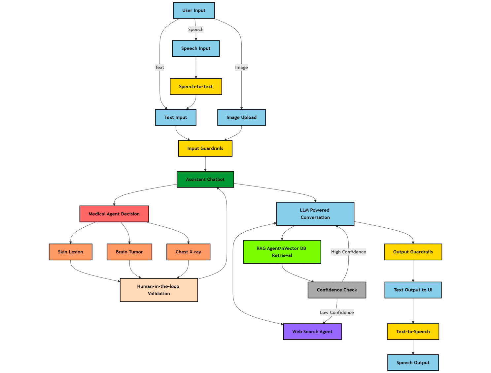

<div align="center">
 


<h1 align="center"><strong>⚕️ Multi-Agent-Medical-Assistant :<h6 align="center">AI-powered multi-agentic system for medical diagnosis and assistance</h6></strong></h1>

<!--  -->


[](https://github.com/souvikmajumder26/Multi-Agent-Medical-Assistant/blob/main/LICENSE) 
[](https://github.com/souvikmajumder26/Multi-Agent-Medical-Assistant/issues)


</div>

----
 
## 📚 Table of Contents
- [Overview](#overview)
- [Demo](#demo)
- [Technical Flow Chart](#technical-flowchart)
- [Key Features](#key-features)
- [Tech Stack](#technology-stack)
- [Installation and Setup](#installation-setup)
- [Usage](#usage)
- [Contributions](#contributions)
- [License](#license)
- [Citing](#citing)
- [Contact](#contact)

----

## 📌 Overview <a name="overview"></a>

The **Multi-Agent Medical Assistant** is an **AI-powered chatbot** designed to assist with **medical diagnosis, research, and patient interactions**.  

🚀 **Powered by Multi-Agent Intelligence**, this system integrates:  
- **🤖 Large Language Models (LLMs)**  
- **🖼️ Computer Vision Models** for medical imaging analysis  
- **📚 Retrieval-Augmented Generation (RAG)** leveraging vector databases  
- **🌐 Real-time Web Search** for up-to-date medical insights  
- **👨‍⚕️ Human-in-the-Loop Validation** to verify AI-based medical image diagnoses  

### **What You’ll Learn from This Project** 👨‍💻📖  
🔹 **Multi-Agent Orchestration** with structured graph workflows  
🔹 **Advanced RAG Techniques** – hybrid retrieval, semantic chunking, and vector search  
🔹 **⚡ Confidence-Based Routing** & **Agent-to-Agent Handoff**  
🔹 **🔒 Scalable, Production-Ready AI with Modularized Code & Robust Exception Handling**  

📂 **For learners**: Check out `agents/README.md` for a **detailed breakdown** of the agentic workflow! 🎯  

<!-- The **Multi-Agent Medical Assistant** is an advanced AI-powered chatbot system designed to assist in medical diagnosis, research, and patient interactions.

Using a **Multi-Agentic framework**, this assistant integrates **Large Language Models, Computer Vision Models, Retrieval Augmented Generation leveraging Vector Database**, and **Web Search** to provide **accurate**, **reliable**, and **up-to-date** medical insights.

This project serves as a **comprehensive resource** for learning and implementing **GenAI with multi-agent orchestration**. It demonstrates **advanced Retrieval-Augmented Generation (RAG)**, integrating **vector search with hybrid retrieval techniques**, **efficient chunking strategies respecting document semantic boundaries**, **confidence-based routing**, **agent-to-agent handoff**, **real-time web search capabilities**, **human-in-the-loop validation** and more. The system incorporates **specialized AI agents** for medical reasoning, diagnosis, and research retrieval, all working seamlessly through a structured graph workflow. Developers will gain insights into **modular agentic AI solution design, and robust exception handling** — ensuring **scalability and production readiness**.

For learners: Refer `agents/README.md` for detailed explanation of the agentic workflow. -->

---

## 💫 Demo <a name="demo"></a>


https://github.com/user-attachments/assets/e096013d-f736-41f7-ae7a-45daf67efd5d


If you like what you see and would want to support the project's developer, you can <a href="https://www.buymeacoffee.com/souvikmajumder" target="_blank"></a> ! :)

📂 **For an even more detailed demo video**: Check out [Multi-Agent-Medical-Assistant-v1.9](assets/Multi-Agent-Medical-Assistant-v1.9_Compressed). 📽️

---

## 🛡️ Technical Flow Chart  <a name="technical-flowchart"></a>



---

<!-- ## 🌟 Key Features  <a name="key-features"></a>
✅ **Multi-Agent System** – Separate agents handle different tasks (diagnosis, retrieval, reasoning, etc.).  
✅ **RAG-based Retrieval** – Uses Qdrant for vector search & hybrid retrieval techniques.  
✅ **Medical Image Analysis** – Supports **brain tumor segmentation, chest X-ray disease detection, and skin lesion classification**.  
✅ **Web Search Agent** – Fetches the latest medical research when required.  
✅ **Confidence Score Check** – Ensures high accuracy with log probability-based verification.  
✅ **Speech-to-Text & Text-to-Speech** – Uses **Eleven Labs API** for voice interactions.  
✅ **Human-in-the-Loop Verification** – Medical professionals validate the AI’s results before final output.  
✅ **Intuitive UI** – Built for seamless user experience.  

---

## 🛠️ Tech Stack  <a name="tech-stack"></a>
🔹 **Backend**: FastAPI 🚀  
🔹 **Multi-Agent Orchestration**: LangGraph + LangChain 🤖  
🔹 **Vector Database**: Qdrant (for retrieval-augmented generation) 🔍  
🔹 **Medical Image Analysis**: Computer vision models (Brain Tumor - Semantic Segmentation, Chest X-ray - Object Detection, Skin Lesion - Classification) 🏥  
🔹 **Speech Processing**: Eleven Labs API 🎙️  
🔹 **UI**: HTML, CSS, JS, Flask 🌐  
🔹 **Deployment**: Docker 🛠️   -->

## ✨ Key Features  <a name="key-features"></a>

- 🤖 **Multi-Agent Architecture** : Specialized agents working in harmony to handle diagnosis, information retrieval, reasoning, and more

- 🔍 **Advanced RAG Retrieval System** : 
  - Unstructured.io parsing to extract and embed text along with tables from PDFs.
  - Semantic chunking with structural boundary awareness.
  - Qdrant hybrid search combining BM25 sparse keyword search along with dense embedding vector search.
  - Query expansion with related terms to enhance search results.
  - Metadata enrichment to add context and improve seach accuracy.
  - Input-output guardrails to ensure safe and relevant responses.
  - Confidence-based agent-to-agent handoff between RAG and Web Search to prevent hallucinations.
  - Supported file types for RAG ingestion and retrieval: .txt, .csv, .json, .pdf.

- 🏥 **Medical Imaging Analysis**  
  - Brain Tumor Detection (TBD)
  - Chest X-ray Disease Classification
  - Skin Lesion Segmentation

- 🌐 **Real-time Research Integration** : Web search agent that retrieves the latest medical research papers and findings

- 📊 **Confidence-Based Verification** : Log probability analysis ensures high accuracy in medical recommendations

- 🎙️ **Voice Interaction Capabilities** : Seamless speech-to-text and text-to-speech powered by Eleven Labs API

- 👩‍⚕️ **Expert Oversight System** : Human-in-the-loop verification by medical professionals before finalizing outputs

- ⚔️ **Input & Output Guardrails** : Ensures safe, unbiased, and reliable medical responses while filtering out harmful or misleading content

- 💻 **Intuitive User Interface** : Designed for healthcare professionals with minimal technical expertise

> [!NOTE]  
> Upcoming features:
> 1. Brain Tumor Medical Computer Vision model integration.
> 2. Streaming of LLM responses to UI.

---

## 🛠️ Technology Stack  <a name="technology-stack"></a>

| Component | Technologies |
|-----------|-------------|
| 🔹 **Backend Framework** | FastAPI, Flask |
| 🔹 **Agent Orchestration** | LangGraph |
| 🔹 **Knowledge Storage** | Qdrant Vector Database |
| 🔹 **Medical Imaging** | Computer Vision Models |
| | • Brain Tumor: Object Detection (PyTorch) |
| | • Chest X-ray: Image Classification (PyTorch) |
| | • Skin Lesion: Semantic Segmentation (PyTorch) |
| 🔹 **Guardrails** | LangChain |
| 🔹 **Speech Processing** | Eleven Labs API |
| 🔹 **Frontend** | HTML, CSS, JavaScript |
| 🔹 **Deployment** | Docker, CI/CD Pipeline |

---

## 🚀 Installation & Setup  <a name="installation-setup"></a>

### 1️⃣ Clone the Repository  
```bash  
git clone https://github.com/souvikmajumder26/Multi-Agent-Medical-Assistant.git  
cd Multi-Agent-Medical-Assistant  
```

### 2️⃣ Create & Activate Virtual Environment  
- If using conda:
```bash
conda create --name <environment-name> python=3.11
conda activate <environment-name>
```
- If using python venv:
```bash
python -m venv <environment-name>
source <environment-name>/bin/activate  # For Mac/Linux
<environment-name>\Scripts\activate     # For Windows  
```

### 3️⃣ Install Dependencies  

> [!IMPORTANT]  
> 1. ffmpeg is required for speech service to work.
> 2. Poppler and Tesseract OCR are essential for table extraction from PDFs using Unstructured.IO.

- To install poppler and tesseract OCR for Ubuntu/Debian/macOS:
```bash
# if on Ubuntu/Debian
sudo apt-get update
sudo apt-get install -y poppler-utils tesseract-ocr
```
```bash
# if on macOS
brew install poppler tesseract
```

- Install Poppler for Windows:
```bash
Download the latest poppler release for Windows from: https://github.com/oschwartz10612/poppler-windows/releases/
Extract the ZIP file to a location on your computer (e.g., 'C:\Program Files\poppler')
Add the bin directory to your PATH environment variable (e.g., 'C:\Program Files\poppler\bin')
```

- Install Tesseract OCR for Windows:
```bash
Download the Tesseract installer from: https://github.com/UB-Mannheim/tesseract/wiki
Run the installer and complete the installation
By default, it installs to 'C:\Program Files\Tesseract-OCR'
Make sure to add it to your PATH during installation or add it manually afterward
```

- Verify your installation:
```bash
Open a new command prompt (to ensure it has the updated PATH)
Run 'tesseract --version' to verify Tesseract is properly installed
Run 'pdfinfo -h' or 'pdftoppm -h' to verify Poppler is properly installed
```

- If using conda:
```bash
conda install -c conda-forge ffmpeg
```
```bash
pip install -r requirements.txt  
```
- If using python venv:
```bash
winget install ffmpeg
```
```bash
pip install -r requirements.txt  
```
- Might be required, might not be:
```bash
pip install unstructured[pdf]
```

### 4️⃣ Set Up API Keys  
- Create a `.env` file and add the following API keys:

> [!NOTE]  
> You may use any llm and embedding model of your choice...
> 1. If using Azure OpenAI, no modification required.
> 2. If using direct OpenAI, modify the llm and embedding model definitions in the 'config.py' and provide appropriate env variables.
> 3. If using local models, appropriate code changes might be required throughout the codebase especially in 'agents'.

> [!WARNING]  
> If all necessary env variables are not provided, errors will be thrown in console.

```bash
# LLM Configuration (Azure Open AI - gpt-4o used in development)
# If using any other LLM API key or local LLM, appropriate code modification is required
deployment_name = 
model_name = gpt-4o
azure_endpoint = 
openai_api_key = 
openai_api_version = 

# Embedding Model Configuration (Azure Open AI - text-embedding-ada-002 used in development)
# If using any other embedding model, appropriate code modification is required
embedding_deployment_name =
embedding_model_name = text-embedding-ada-002
embedding_azure_endpoint = 
embedding_openai_api_key = 
embedding_openai_api_version = 

# Speech API Key (Free credits available with new Eleven Labs Account)
ELEVEN_LABS_API_KEY = 

# Web Search API Key (Free credits available with new Tavily Account)
TAVILY_API_KEY = 

# Hugging Face Token - using reranker model "ms-marco-TinyBERT-L-6"
HUGGINGFACE_TOKEN = 

# (OPTIONAL) If using Qdrant server version, local does not require API key
QDRANT_URL = 
QDRANT_API_KEY = 
```

### 5️⃣ Run the Application  
- Run the following commands one after another in separate windows with same directorty and virtual environment. Keep both running simultanesouly.
```bash  
uvicorn api.fastapi_backend:app --reload
```

```bash
python app.py
```

### 6️⃣ Ingest additional data into the Vector DB
- Run any one of the following commands as required. First one to ingest one document at a time, second one to ingest multiple documents from a directory.
```bash
python ingest_rag_data.py --file ./data/raw/brain_tumors_ucni.pdf
```

```bash
python ingest_rag_data.py --dir ./data/raw
```

---

## 🧠 Usage  <a name="usage"></a>

> [!NOTE]
> 1. The first run can be jittery and may get errors - be patient and check the console for ongoing downloads and installations.
> 2. On the first run, many models will be downloaded - yolo for tesseract ocr, computer vision agent models, cross-encoder reranker model, etc.
> 3. Once they are completed, retry. Everything should work seamlessly since all of it is thoroughly tested.

- Upload medical images for **AI-based diagnosis**. Task specific Computer Vision model powered agents - upload images from 'sample_images' folder to try out.
- Ask medical queries to leverage **retrieval-augmented generation (RAG)** if information in memory or **web-search** to retrieve latest information.  
- Use **voice-based** interaction (speech-to-text and text-to-speech).  
- Review AI-generated insights with **human-in-the-loop verification**.  

---

## 🤝 Contributions  <a name="contributions"></a>
Contributions are welcome! Please check the [issues](https://github.com/souvikmajumder26/Multi-Agent-Medical-Assistant/issues) tab for feature requests and improvements.  

---

## ⚖️ License  <a name="license"></a>
This project is licensed under the **Apache-2.0 License**. See the [LICENSE](LICENSE) file for details.  

---

## 📝 Citing <a name="citing"></a>
```
@misc{Souvik2025,
  Author = {Souvik Majumder},
  Title = {Multi Agent Medical Assistant},
  Year = {2025},
  Publisher = {GitHub},
  Journal = {GitHub repository},
  Howpublished = {\url{https://github.com/souvikmajumder26/Multi-Agent-Medical-Assistant}}
}
```

---

## 📬 Contact  <a name="contact"></a>
For any questions or collaboration inquiries, reach out to **Souvik Majumder** on:  

🔗 **LinkedIn**: [https://www.linkedin.com/in/souvikmajumder26](https://www.linkedin.com/in/souvikmajumder26)

🔗 **GitHub**: [https://github.com/souvikmajumder26](https://github.com/souvikmajumder26)

<p align="right">
 <a href="#top"><b>🔝 Return </b></a>
</p>

---
