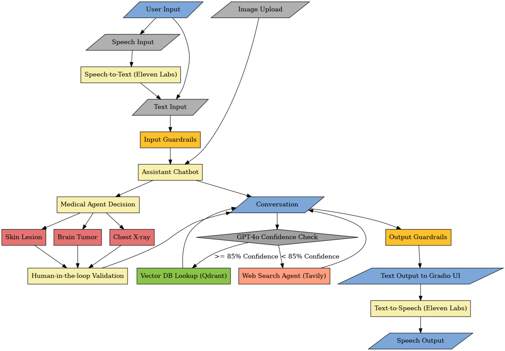

<div align="center">
 


<h1 align="center"><strong>⚕️ Multi-Agent-Medical-Assistant:<h6 align="center">AI-powered multi-agentic system for medical diagnosis and assistance</h6></strong></h1>

<!--  -->


[](https://github.com/souvikmajumder26/Multi-Agent-Medical-Assistant/blob/main/LICENSE) 
[](https://github.com/souvikmajumder26/Multi-Agent-Medical-Assistant/issues)


</div>

----
 
## 📚 Table of Contents
- [Overview](#overview)
- [Key Features](#key-features)
- [Demo](#demo)
- [Technical Workflow](#technical-workflow)
- [Getting Started](#getting-started)
  - [Prerequisites](#prerequisites)
  - [Setting up and Running the project with Docker](#with-docker)
  - [Setup without Docker](#setup)
  - [Running the project without Docker](#running-the-project)
- [Citing](#citing)
- [License](#license)
- [Acknowledgements](#acknowledgements)

----

## 📌 Overview <a name="overview"></a>
The **Multi-Agent Medical Assistant** is an advanced AI-powered chatbot system designed to assist in medical diagnosis, research, and patient interactions. Using a **multi-agent framework**, this assistant integrates **LLMs, computer vision models, retrieval-based techniques, and web search** to provide **accurate**, **reliable**, and **up-to-date** medical insights.

---

## 🌟 Key Features  <a name="key-features"></a>
✅ **Multi-Agent System** – Separate agents handle different tasks (diagnosis, retrieval, reasoning, etc.).  
✅ **RAG-based Retrieval** – Uses Qdrant for vector search & hybrid retrieval techniques.  
✅ **Medical Image Analysis** – Supports **brain tumor segmentation, chest X-ray disease detection, and skin lesion classification**.  
✅ **Web Search Agent** – Fetches the latest medical research when required.  
✅ **Confidence Score Check** – Ensures high accuracy with log probability-based verification.  
✅ **Speech-to-Text & Text-to-Speech** – Uses **Eleven Labs API** for voice interactions.  
✅ **Human-in-the-Loop Verification** – Medical professionals validate the AI’s results before final output.  
✅ **Intuitive UI** – Built for seamless user experience.  

---

## 💫 Demo <a name="demo"></a>

https://github.com/souvikmajumder26/Multi-Agent-Medical-Assistant/blob/main/assets/Medical_Assistant_Demo.mp4

---

## 📌 Technical Workflow  <a name="technical-workflow"></a>


---

## 🛠️ Tech Stack  
🔹 **Backend**: FastAPI 🚀  
🔹 **Multi-Agent Orchestration**: LangGraph + LangChain 🤖  
🔹 **Vector Database**: Qdrant (for retrieval-augmented generation) 🔍  
🔹 **Medical Image Analysis**: Computer vision models (Brain Tumor Segmentation, Chest X-ray Disease Detection, Skin Lesion Classification.) 🏥  
🔹 **Speech Processing**: Eleven Labs API 🎙️  
🔹 **UI**: HTML, CSS, JS, Flask 🌐  
🔹 **Deployment**: Docker 🛠️  

---

## 🚀 Installation & Setup  

### 1️⃣ Clone the Repository  
```bash  
git clone https://github.com/souvikmajumder26/Multi-Agent-Medical-Assistant.git  
cd Multi-Agent-Medical-Assistant  
```

### 2️⃣ Create & Activate Virtual Environment  
```bash  
python -m venv venv  
source venv/bin/activate  # For Mac/Linux  
venv\Scripts\activate     # For Windows  
```

### 3️⃣ Install Dependencies  
```bash  
pip install -r requirements.txt  
```

### 4️⃣ Set Up API Keys  
- Create a `.env` file and add API keys (Azure OpenAI, Eleven Labs, etc.).  

### 5️⃣ Run the Application  
- Run the following commands in separate windows simultaneously.
```bash  
uvicorn api/fastapi_backend:app --reload
```

```bash
python app.py
```

---

## 📌 Usage  
- Upload medical images for **AI-based diagnosis**.  
- Ask medical queries using **retrieval-augmented generation (RAG)**.  
- Use **voice-based** interaction (speech-to-text and text-to-speech).  
- Review AI-generated insights with **human-in-the-loop verification**.  

---

## 🤝 Contributing  
Contributions are welcome! Please check the [issues](https://github.com/souvikmajumder26/Multi-Agent-Medical-Assistant/issues) tab for feature requests and improvements.  

---

## ⚖️ License  
This project is licensed under the **Apache-2.0 License**. See the [LICENSE](LICENSE) file for details.  

---

## 📬 Contact  
For any questions or collaboration inquiries, reach out to **Souvik Majumder** on:  

🔗 **LinkedIn**: [https://www.linkedin.com/in/souvikmajumder26](https://www.linkedin.com/in/souvikmajumder26)

🔗 **GitHub**: [https://github.com/souvikmajumder26](https://github.com/souvikmajumder26)  
